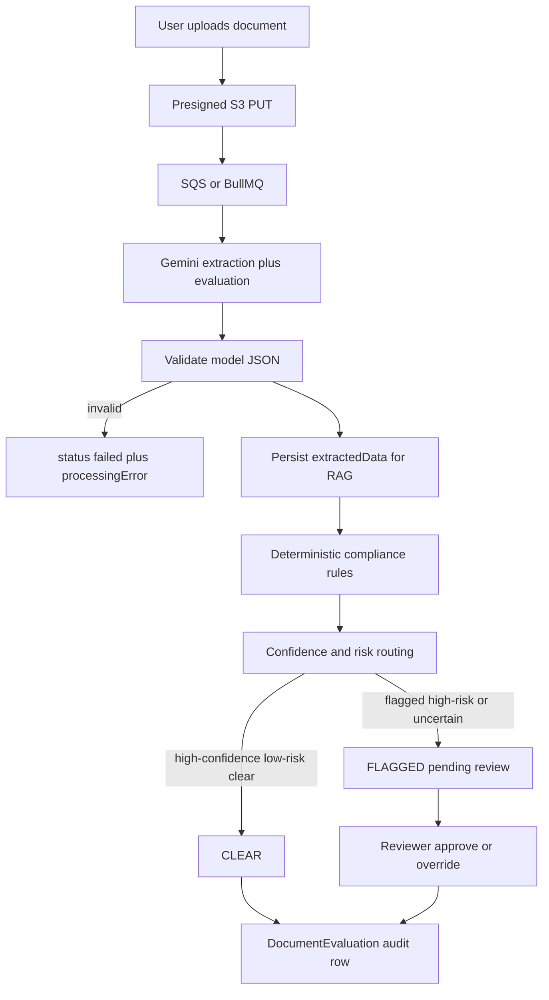

# Ai Compliance 
### AI-Assisted Compliance

**Ai Compliance** is a prototype internal compliance tool designed for organisations that manage time-sensitive documents such as licenses, certifications, permits, or insurance policies.

The system automatically extracts expiry dates from uploaded documents, monitors them continuously, and reminds users before deadlines (e.g. 30 days before expiry) to reduce compliance risk and operational disruption.

---

## Problem Statement

Many organisations rely on documents that have strict expiry or renewal deadlines:

- Licenses and permits 
- Certifications
- Insurances 

In practice, these documents are:
- Stored as PDFs or photos
- Manually checked
- Easy to miss when expired
- Often discovered only during audits or incidents

The result:
- Missed deadlines
- Compliance breaches
- Fines
- Legal risks

**Ai Compliance automates this workflow** by extracting key dates directly from documents and monitoring them automatically.

---

## Core Idea

Instead of manual data entry:

> A user uploads a document.
The system extracts structured data, evaluates it for compliance issues, applies deterministic rules, and routes uncertain or flagged cases to a human reviewer.

The system is designed as an **internal operations tool**, not a public marketplace.

---

## Key Features

### 1. AI-Based Document Extraction and Evaluation
- Accepts photos or scans of documents
- Uses multimodal AI to extract:
  - Expiry date and issue date
  - License / certificate number
  - Holder name
  - Verbatim per-page text (for retrieval)
- The same model call also returns a structured compliance evaluation:
  - decision, risk, confidence, issue type, explanation, and evidence quotes
- Handles varied layouts and low-quality images

### 2. Ask Your Documents (Retrieval)
- Plain-language questions answered from your own uploaded documents only
- Chunking + embeddings in Postgres (`pgvector`), hybrid vector + keyword search
- Every retrieval is filtered by user and project inside the SQL, so answers
  respect existing access control
- Answers cite the source document and page, and say "not found in your
  documents" rather than guessing
- Backed by a 32-question evaluation set measuring retrieval accuracy and
  answer accuracy **separately** — see [docs/ask-your-documents.md](docs/ask-your-documents.md)

### 3. Deadline & Compliance Tracking
- Stores extracted expiry dates in structured form
- Automatically calculates:
  - Expired
  - Expiring soon (e.g. within 30 days)
  - Valid

### 4. Asynchronous Processing
- Document analysis runs in background workers (SQS + Lambda, or local BullMQ)
- Uploads return immediately
- Prevents UI blocking and API timeouts
- Scales independently of user traffic
- Invalid model JSON is stored as `failed` with `processingError`, not as a successful extraction

### 5. Compliance Monitoring & Alerts
- Scheduled jobs scan documents daily
- Flags upcoming expiries
- Sends automated reminders via email/SMS

### 6. Compliance Overview API
- Endpoint: `GET /api/documents/overview`
- Returns compliance-ready totals (`expired`, `expiringSoon`, `valid`, `missingExpiry`, etc.)
- Supports configurable expiry windows via `expiringWithinDays` query param
- Includes nearest expiring documents for dashboards and audit workflows

### 7. Human Review and Override
- Flagged, high-risk, or low-confidence evaluations enter a review queue
- Reviewers see the document, AI decision, confidence, severity, evidence, and extracted fields
- Approve confirms the routed decision; reject records a human override
- The model is never the final authority

---

## System Architecture



The API is the write authority. Lambda reports raw model JSON; `applyProcessingResult` validates it, runs rules, routes the case, and persists an append-only `DocumentEvaluation`. Local Node workers call the same function so they cannot skip validation.

### Why this architecture?
- AI calls are slow and unreliable → async processing
- Model output is untrusted → schema validation before it reaches Postgres
- Calendar facts must not depend on the model → deterministic rules
- Compliance decisions must be auditable → evaluation rows keep model id, prompt version, evidence, and reviewer action even after prompts change

---

## AI evaluation flow

1. **LLM (advisory).** Gemini returns extraction fields plus `decision`, `risk`, `confidence`, `issueType`, `explanation`, and `evidence`. Prompt version: `compliance-eval-v1`.
2. **Validation.** `parseLlmEvaluation` treats the payload as untrusted input. Malformed JSON, invalid enums, confidence outside 0–1, or broken evidence never become a `processed` document. The document is marked `failed` with `processingError: invalid_model_output`, and the worker callback still returns 200 so SQS does not retry a permanently bad schema. Transient Gemini/S3 errors still throw and retry.
3. **Deterministic rules.** Separate from the model. They flag expired documents, missing expiry/licence number, unparseable dates, issue date after expiry, and “model said clear but the date is already past.”
4. **Routing.** Auto-CLEAR only when there are no rule hits, the model is `clear`, risk is `low`, and confidence ≥ 0.8. Flagged, high-risk, uncertain, or low-confidence results enter the review queue. Thresholds live as named constants in `src/services/compliance/routing.ts`.
5. **Human review.** `GET /api/reviews` lists pending cases. `POST /api/documents/:id/review` records approve or reject/override with reviewer id and timestamp.

The LLM proposes; rules can escalate; humans can override.

---

## Tech Stack

### Backend
- Node.js + TypeScript
- Express
- PostgreSQL + Prisma + pgvector
- AWS SQS + Lambda (production path)
- BullMQ + Redis (optional local path)

### AI
- Google Gemini (multimodal extraction, evaluation, RAG answers, embeddings)
- Structured JSON with an explicit validation layer

### Frontend
- React
- Material UI
- Dashboard with document list plus a review queue

### Infrastructure
- Docker
- Environment-based configuration
- Local or cloud-ready

---

## Why These Choices?

### Why AI instead of OCR?
Traditional OCR fails on:
- Handwritten expiry dates
- Inconsistent layouts
- Jurisdiction-specific logic

Multimodal AI allows **extraction + reasoning**, not just text recognition. Reasoning is still checked by deterministic rules.

---

### Why PostgreSQL?
Relational storage holds users, projects, documents, and an append-only evaluation audit trail with enforced foreign keys. `extractedData` remains JSON for heterogeneous document types. pgvector on the same database powers retrieval without a second store.

---

### Why Background Jobs?
AI analysis can take seconds and fail intermittently.

Using queues allows:
- Retry logic
- Failure isolation
- Non-blocking APIs
- Horizontal scaling of workers

---

## Trade-offs

Design decisions here are deliberate compromises between a credible production-minded workflow and keeping the prototype maintainable.

### AI extraction vs OCR or manual rules
**Gains:** Handles messy scans, handwritten fields, and layout variety that brittle parsers miss.  
**Costs:** Higher per-document cost and latency than pure OCR, nondeterministic edge cases. Regulatory liability still sits with humans, not the model.

### Deterministic rules vs trusting the model
**Gains:** Expiry, missing fields, and contradictory dates do not depend on Gemini. The architecture makes it obvious which decisions came from which layer.  
**Costs:** Rules only cover this product’s domain (licences, certificates, insurance). They are not a general policy engine.

### Append-only evaluations vs overwriting JSON
**Gains:** Historical decisions remain understandable after a prompt or model change (`modelId` + `promptVersion` are stored on each row).  
**Costs:** Extra table and queries for “latest evaluation.”

### Owner-as-reviewer vs moderator RBAC
**Gains:** Fits the existing single-user auth model; still records `reviewerId` and timestamp.  
**Costs:** A production moderation squad would use dedicated reviewer roles and an independent queue. That is an explicit next step, not a fake role system.

### One Gemini call vs a second evaluation pass
**Gains:** No extra latency or cost; extraction and evaluation stay in sync.  
**Costs:** The extraction prompt and the Lambda copy of it must stay aligned (`compliance-eval-v1`).

### PostgreSQL JSON extraction vs a fully normalised schema
**Gains:** Heterogeneous document types can evolve without a migration per field; RAG still reads `extractedData.pages`.  
**Costs:** Fewer DB-level constraints on extracted fields; validation lives in application code.

### Asynchronous workers vs synchronous API responses
**Gains:** APIs stay fast and tolerant of slow or flaky AI providers; workers can retry and scale out.  
**Costs:** Users see eventual consistency until processing finishes. Permanent schema failures are stored, not retried forever.

### Cloud queue & object storage vs Redis and local disks
**Gains:** Durable uploads, managed scaling, and a path to production-aligned deployments.  
**Costs:** More moving pieces than an all-on-one-machine stack.

### Prototype breadth vs enterprise controls
**Gains:** The core workflow (upload → evaluate → route → review) ships with JWT auth and billing scaffolding.  
**Costs:** Subscription state syncing, org-wide tenancy, and dedicated moderator teams remain follow-on work.

---

## Testing strategy

Backend tests use Jest and Supertest. External Gemini and AWS calls are mocked. The suite covers:

- Successful API requests and authentication (`auth`, `document`, `project`, `ask`)
- Validation of malformed LLM JSON
- Deterministic compliance rules
- Confidence / routing decisions
- Worker callback success, auth failure, and invalid model output (document marked failed, callback still 200)
- Human approve and reject/override, plus 401 / 404 / 409 paths

```bash
npm test
```

---

## Evaluation harnesses

There are two harnesses. Neither is a claim of production accuracy.

### Retrieval / answer eval

Requires Postgres with pgvector and a `GEMINI_API_KEY`. See [docs/ask-your-documents.md](docs/ask-your-documents.md).

```bash
npm run eval
```

### Compliance decision eval

Runs the synthetic dataset in `eval/compliance/dataset.ts` through parse → rules → route. No live LLM. Measures correct decisions, false positives (flagged when gold is clear), and false negatives (cleared when gold is flagged). Writes `eval/compliance/results.json` with `promptVersion` so later prompt or threshold changes can be compared.

```bash
npm run eval:compliance
```

Cases include a valid document, expired certification, missing information, contradictory dates, ambiguous/low-confidence output, and an expired high-risk work licence. This is an engineering regression harness, not proof of model performance in the real world.

---

## Development Roadmap

### Phase 1 – AI Core
- [x] Node.js + TypeScript setup
- [x] Gemini API integration
**Goal:** Prove reliable extraction from real documents

### Phase 2 – Application Layer
- [x] MongoDB schemas (User, Document) → replaced by PostgreSQL / Prisma
- [x] File upload handling
- [x] BullMQ worker pipeline  
**Goal:** Reliable storage & processing pipeline

### Phase 3 – Product Layer (MVP)
- [x] React dashboard
- [x] Scheduled expiry checks
- [x] Notification  
**Goal:** End-to-end usable prototype

### Phase 4 – Cloud
- [x] S3 (replace local storage)
- [x] SQS (replace queue and redis)
- [x] Lambda (replace worker) 
**Goal:** Utilzing cloud services

### Phase 5 – The "SaaS" Architecture
- [x] Test Case
- [x] Authentication (JWT)
- [ ] WebSocket
- [ ] Multi-Tenancy (Organization and team members)
- [x] Payments (Stripe Checkout)
**Goal:** Transform it from a "Single-Player Demo" into a "Multi-User Platform" ready for paying customers.

Payments now use a hosted Stripe Checkout flow:

- Signed-in users can start a subscription checkout session from the dashboard
- The backend creates the Stripe Checkout session with the authenticated user attached as metadata
- Billing URLs are environment-driven so local, staging, and production environments can each return to the correct frontend

What is still intentionally left for the next SaaS step:

- Stripe webhooks to persist subscription state in PostgreSQL
- Entitlement checks that gate features by plan
- Organization-level billing once multi-tenancy is complete

### Phase 6 – The "Final" Polish
- [x] Landing Page
- [ ] Email/Phone Notifications
**Goal:** Make it look production-ready

---

## Authentication API (JWT)

The backend uses email/password auth with short-lived access tokens and httpOnly refresh cookies. Refresh token IDs are tracked in memory (sessions reset on server restart).

### Environment variables

```env
JWT_SECRET=replace_with_a_long_random_jwt_secret
JWT_ACCESS_TOKEN_TTL=15m
JWT_REFRESH_TOKEN_TTL=7d
```

### Abuse-prevention controls (recommended for production)

The API now supports layered controls to prevent automated abuse of Gemini endpoints:

```env
# API throttling
AUTH_RATE_LIMIT_MAX=30
UPLOAD_RATE_LIMIT_MAX=40
WORKER_CALLBACK_RATE_LIMIT_MAX=300

# CAPTCHA (Cloudflare Turnstile by default)
CAPTCHA_ENABLED=true
CAPTCHA_SECRET_KEY=replace_with_turnstile_secret
CAPTCHA_VERIFY_URL=https://challenges.cloudflare.com/turnstile/v0/siteverify

# AI usage quotas / entitlement controls
FREE_DAILY_GEMINI_LIMIT=25
PAID_DAILY_GEMINI_LIMIT=300
MAX_PENDING_DOCUMENTS_PER_USER=10
MAX_DAILY_UPLOAD_INTENTS_PER_USER=60
REQUIRE_PAID_PLAN_FOR_GEMINI=false
PAID_USER_IDS=
PAID_USER_EMAILS=
BLOCKED_USER_IDS=
BLOCKED_USER_EMAILS=
```

Notes:
- `CAPTCHA_ENABLED=true` requires clients to provide `captchaToken` (body) or `x-captcha-token` (header) on auth endpoints.
- Demo login in the frontend is disabled in production unless `VITE_ENABLE_DEMO_LOGIN=true`.
- AI queueing now fails fast with `403/429` when a user is blocked or exceeds quota.

### Endpoints

| Endpoint | Auth | Request | Response |
|----------|------|---------|----------|
| `POST /api/auth/register` | Public | `{ name?, email, password }` | `{ accessToken, user }` + refresh cookie |
| `POST /api/auth/login` | Public | `{ email, password }` | `{ accessToken, user }` + refresh cookie |
| `POST /api/auth/refresh` | Cookie | Send `Cookie: refreshToken=...` | `{ accessToken, user }` + rotated refresh cookie |
| `POST /api/auth/logout` | Cookie | Optional refresh cookie | `{ message }` |
| `GET /api/auth/me` | Bearer | `Authorization: Bearer <accessToken>` | `{ user }` |

All other protected API routes require `Authorization: Bearer <accessToken>`.

### Frontend integration

The React app uses in-memory JWT auth via `AuthProvider`:

- Sign in / register from the header dialog
- `TRY DEMO` logs in or registers `demo@mail.com`
- Access tokens stay in memory; refresh uses an httpOnly cookie
- On `401`, the API client refreshes the session and retries

---

## Example Use Case

1. Site manager uploads a photo of a White Card
2. System processes it asynchronously
3. Expiry date is extracted and validated
4. Status appears as:
   - Clear (auto or after approval)
   - Needs review
   - Overridden
   - Failed
5. Reminder is automatically scheduled

---

## Limitations (By Design)

This project intentionally does **not**:
- Attempt fraud detection
- Replace compliance officers
- Automate legal decisions

The AI provides **decision support**, not authority.

---

## Future Improvements (Out of Scope for This Prototype)

The current system intentionally focuses on the core compliance workflow.
The following improvements were consciously left out to maintain scope and clarity:

Authentication & Access Control

- User authentication and role-based access (e.g. admin vs viewer)
- Organisation-level document ownership
- Audit logs for document changes and overrides → evaluation rows now capture AI + reviewer decisions; dedicated moderator RBAC is still out of scope

Cloud & Infrastructure
- Object storage for uploads (e.g. S3-compatible storage)
- Horizontal scaling of workers
- Managed Redis / MongoDB services

Reliability & Observability
- Job metrics and dashboards
- Dead-letter queues for failed jobs
- Structured logging and tracing

Integrations
- Calendar integrations (Google / Outlook)
- Webhooks for external systems
- Compliance export reports

---

## Getting Started

```bash
# Clone
git clone https://github.com/Vanndavid/AiCompliance.git
cd AiCompliance
docker-compose up -d --build

# At this point, the application has evolved to using AWS services, so to setup local development
# 1. Uncomment redis, mongodb, worker, in docker-compose.yml to use them
# 2. You need to point the API to use local drivers instead of AWS SDKs in api.ts
#    // src/routes/api.ts
#    // import { upload } from "../middleware/uploadMiddleware"; // AWS S3 ☁️
#    import { upload } from "../middleware/uploadLocal";         // Local Disk 💻
# 3. Queue Driver (src/controllers/documentController.ts) Switch the job producer from SQS to BullMQ:
#    // src/controllers/documentController.ts
#    // import { addDocumentJob } from "../queues/sqsProducer";   // AWS SQS ☁️
#    import { addDocumentJob } from "../queues/documentQueue";  // Redis BullMQ 💻

# go to http://localhost:5173/

# Testing Backend
docker exec -it aicompliance_backend npm test
